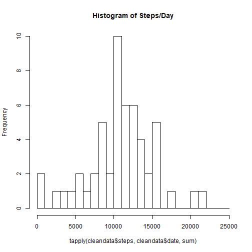
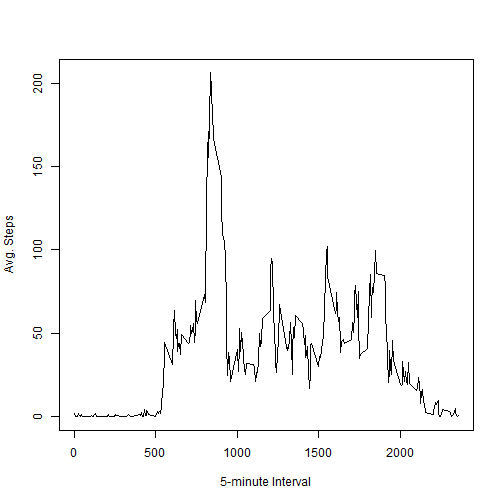
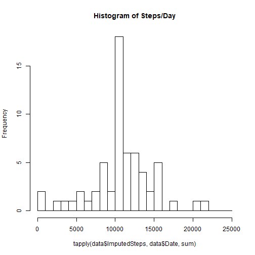
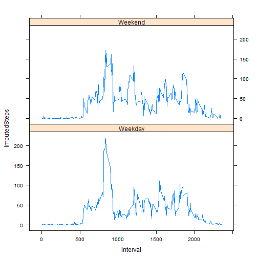

```r
inline_hook <- function(x) {
  if (is.numeric(x)) {
    format(x, digits = 4)
  } else x
}
knitr::knit_hooks$set(inline = inline_hook)
```

##Load and Pre-process the Data
Here we need to convert the data into a form suitable for analysis.  I notice that the date column is of
thetype 'factor' and the other two columns are of the type "int".  I convert the date column to a 'date'
class and the other two columns to the "numeric" class.

```r
data <- read.csv("activity.csv")

#convert to date and numeric types classes.
data$steps <- as.numeric(data$steps)
data$date <- as.Date(data$date)
data$interval <- as.numeric(data$interval)
```

## What is mean total number of steps taken per day?

```r
cleandata <- data[is.na(data$steps)==FALSE,]
mean_steps <- tapply(cleandata$steps, cleandata$date, sum)
hist(tapply(cleandata$steps, cleandata$date, sum), main = "Histogram of Steps/Day", breaks=seq(0,25000,1000))
```



```r
mean(mean_steps, na.rm=TRUE)
```

```
## [1] 10766.19
```

```r
median(mean_steps, na.rm=TRUE)
```

```
## [1] 10765
```

```r
AvgSteps <- mean(mean_steps, na.rm=TRUE)
MedSteps <- median(mean_steps, na.rm=TRUE)
```

Mean Total Daily Steps = 10766 steps  
Median Total Daily Steps = 10765 steps

## What is the average daily activity pattern?

```r
AvgSteps5min <- aggregate( cleandata$steps ~ cleandata$interval, FUN = mean)
names(AvgSteps5min) <- c("Interval","AverageSteps")
head(AvgSteps5min)
```

```
##   Interval AverageSteps
## 1        0    1.7169811
## 2        5    0.3396226
## 3       10    0.1320755
## 4       15    0.1509434
## 5       20    0.0754717
## 6       25    2.0943396
```

```r
plot(AvgSteps5min$Interval, AvgSteps5min$AverageSteps, type = "l", xlab = "5-minute Interval", ylab = "Avg. Steps")
```



```r
MaxInterval <- AvgSteps5min[which.max(AvgSteps5min$AverageSteps),1]
```

The 5-minute interval with the highest average number of steps is 835 with 104 steps.

## Impute Missing Values

```r
names(data) <- c("Steps","Date","Interval")
data$ImputedSteps <- data$Steps
head(data)
```

```
##   Steps       Date Interval ImputedSteps
## 1    NA 2012-10-01        0           NA
## 2    NA 2012-10-01        5           NA
## 3    NA 2012-10-01       10           NA
## 4    NA 2012-10-01       15           NA
## 5    NA 2012-10-01       20           NA
## 6    NA 2012-10-01       25           NA
```
Notice above that the values of ImputedSteps column are all NA. 

Now we will impute values using the calculated averagesby 5-minute interval.

```r
for(i in which(is.na(data$Steps))){
    data$ImputedSteps[i] <- AvgSteps5min$AverageSteps[which(AvgSteps5min$Interval == data$Interval[i] )]
}

head(data)
```

```
##   Steps       Date Interval ImputedSteps
## 1    NA 2012-10-01        0    1.7169811
## 2    NA 2012-10-01        5    0.3396226
## 3    NA 2012-10-01       10    0.1320755
## 4    NA 2012-10-01       15    0.1509434
## 5    NA 2012-10-01       20    0.0754717
## 6    NA 2012-10-01       25    2.0943396
```
Notice now how the values of ImputedSteps column are filled in with average values  
taken from the AvgSteps5min table.


```r
hist(tapply(data$ImputedSteps, data$Date, sum), main = "Histogram of Steps/Day", breaks=seq(0,25000,1000))
```



```r
ImputedAvgSteps <- tapply(data$ImputedSteps, data$Date, sum)

ImputedMean <- mean(ImputedAvgSteps)
ImputedMed <- median(ImputedAvgSteps)
```

The imputed mean number of steps taken per day is 10766 steps.  
The imputed median number of steps taken per day is 10766 steps.  

Notice that the mean didn't change with the imputed values, but the median change from
10765 steps to 10766 steps.

## Are there differences in activity patterns between weekdays and weekends?

```r
library(lubridate)
data$Day <- weekdays(as.POSIXct(data$Date))
data$DayNumber <- wday(as.POSIXct(data$Date))
for(i in 1:dim(data)[1]){

if(data$DayNumber[i] == 1){
    data$Weekend[i] <- "Weekend"
} else if(data$DayNumber[i] == 7){
    data$Weekend[i] <- "Weekend"
} else { data$Weekend[i] <- "Weekday"}
}

WkDayAvgSteps5min <- aggregate(ImputedSteps ~ Weekend + Interval, data = data, FUN = mean)

library(lattice)
data <- transform(data, Weekend = factor(Weekend))
xyplot(ImputedSteps ~ Interval | Weekend, data = WkDayAvgSteps5min , layout = c(1,2), type = "l")
```



